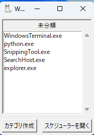
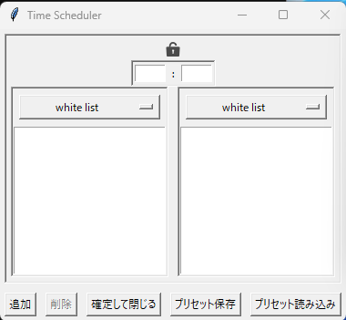
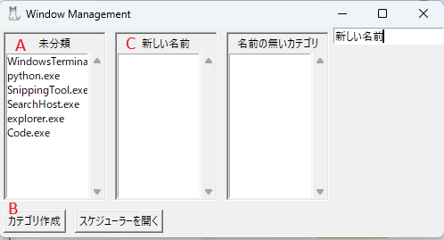
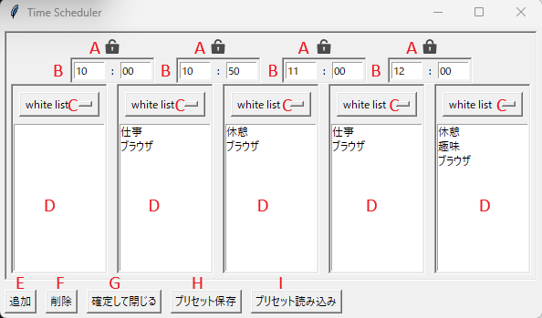
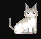

# 目的
PCのアクティブウィンドウ(最前面で作業中のアプリケーション)を監視し、以下の事を行う
1. 各アプリケーションを任意のカテゴリに分け、スケジュール管理に使う
   1. 作成したスケジュールに基づいてデスクトップ上の猫のメイトが休憩や仕事の再開を促す
2. 日,週,月単位で統計を確認できるようにし、自分にとって無駄な時間が無いかチェックする
2についてはログ出力は出来ているがUI未実装

# 使用方法
https://github.com/110syun/ManagementApplication/tree/dev
起動すると以下の二つのウィンドウが立ち上がる
①

②

- ① メイン画面
  - 
  - A 作業中のアプリケーションを監視し、カテゴリに入っていないものを「未分類」カテゴリに追加する
  - B [カテゴリ作成]ボタン
    - 新規にカテゴリを作成する
  - C カテゴリ名
    - ダブルクリックで名前を変更するためのフォームが開く
  - ドラッグ＆ドロップで何のアプリケーションがどのカテゴリに属すかを変更できる

- ② スケジューラー
  - 
  - A 予定を超過して前の作業をしている際に、超過した時間分だけシフトさせるかを選択できる
    - クリックで変更可能
  - B 時刻入力フォーム
    - 00:00~23:59の間で入力
  - C その時間帯に何のカテゴリを<許可/禁止>するか選択できる
    - クリックでWhite listかBlack listか変更可能
    - リストボックスに何もカテゴリが指定されていない場合は<全て許可/全て禁止>になる
  - D メイン画面で作成したカテゴリをボックスにドラッグ&ドロップで追加できる
    - 追加されたカテゴリは右クリックで削除できる
  - E 新しい時間帯を追加する
  - F 最後の時間帯を削除する
  - G スケジュールを確定し、Timekeeper(猫)をポップする
    - メイン画面からスケジューラーを開く事で再度編集可能
  - H プリセット保存
    - 作成したスケジュールをプリセットとして保存する
  - I プリセット読み込み
    - 保存したプリセットを読み込む

スケジューラーを閉じるとTimekeeper(猫)がポップします

スケジュール通りの行動をしていると猫はウィンドウの右下に、スケジュール外の行動をするとウィンドウ中央に来ます。
スケジュールを10分以上超過すると、勝手にキーボード[A]を連打します

# 機能要件
###### 記録機能
- 作業しているアプリケーションの記録
  - 各アプリケーション毎にジャンル分けをできるようにする
    - [仕事,勉強]-集中を要するもの、適度に休息が必要となるもの(例:VSCode,Terminal等)
    - [休憩]-集中を要さずに息抜きに該当するもの(例:Browser,SNS等)
    - [趣味A]-趣味やゲームのうち、集中を要し熱中しがちなもの(例:パズルゲーム,将棋等)
    - [趣味B]-趣味やゲームのうち、集中を要さずリラックスして行うもの(例:友人とのVC,ボードゲーム)
    - [その他]-上記の何れにも該当しないもの
- アクティブウィンドウから自分のステータスを記録する
  - ログの分析
    - 週ごと、月ごとの作業時間をグラフで表示
    - 各ジャンルごとの時間を比較
    - データのエクスポート(CSVやExcel等)
- スマートフォンアプリと連携し、外出先でも通知を受け取れるようにする。
  - スマホを触っている時間も可視化できる？

###### 通知機能
- ストレッチ通知
  - 一定時間ごとにストレッチや軽い運動を促す通知を表示
  - 簡単なストレッチのガイドを表示
- 目の休憩タイマー
  - 画面を見続ける時間を管理し、目の休憩を促す通知を表示
- カレンダー連携
  - GoogleカレンダーやOutlookカレンダーと連携し、予定に基づいて作業時間を自動調整
  - カレンダーの予定に基づいて通知を表示
- タスク管理ツールとの連携
  - タスク管理ツールと連携し、タスクの進捗を管理
- ジャンル毎、アプリケーション毎に設定できるカスタムタイマー
 
###### 目標設定と進捗管理
- タスク・ゴールボード: 日々や週ごとの目標を設定し、達成状況やタスクの進捗を視覚化するダッシュボード機能

###### 管理者
- 管理者としてデスクトップメイト(猫)を設置する
  - Pixel artで作成(或いはフリー素材を使用,コストによっては購入も視野)
  - 普段は邪魔にならない様にする
    - 猫ベッドを置いてそこで寝るのが定位置,等
  - 休憩を強要する存在
    - 作業中のウィンドウに被さるように動き回る等
    - 最終的にアプリの「X」ボタンを押しちゃう
    - PCの操作をやめたり[休憩]に該当するアプリケーションを操作していると飽きてベッドに戻る
  - 各種タイマーは可視化せずメイトが様々な形で知らせるようにする

###### その他
- セルフチェック機能
  - 定期的に簡単なアンケート形式でストレスや気分を入力できる機能を追加する
  - デイリーログ、その日の感想等を記録できるエリアを設け、後で振り返りや改善に活用

###### 課題
- ブラウザは勉強にも休憩にも使う
  - 仕事,勉強用のブラウザと休憩用のブラウザを別にする(仕事はChromium,その他のことにはChromeを使う等)